# <h1 align=center> IBM Cloud Engine

Con IBM Cloud Engine podrá realizar despliegues de aplicaciones en segundos con un modelo totalmente Serverless.

IBM Cloud Engine permite realizar despliegue de aplicaciones a partir de una imagen [Docker](https://www.docker.com/) :whale: o directamente del código fuente.

### 📑 Tabla de contenido

1. [Requisitos](#requisitos)
2. [Hands On!](#-hands-on)
3. [Recursos Adicionales](#recursos-adicionales)

### Requisitos

- Cuenta de [IBM Cloud](https://cloud.ibm.com) :cloud:

### :hand: Hands On!

1. En el menú hamburguesa, seleccionamos el servicio Code Engine.

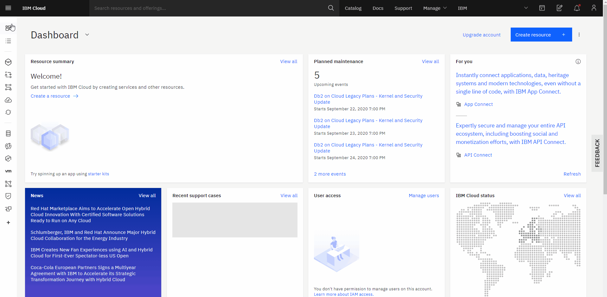

2. Seleccionamos la pestaña Projects y luego en el botón **Crear**. Asignele el nombre de su preferencia ejemplo: "my-app". Finalmente de nuevo click en el botón crear.

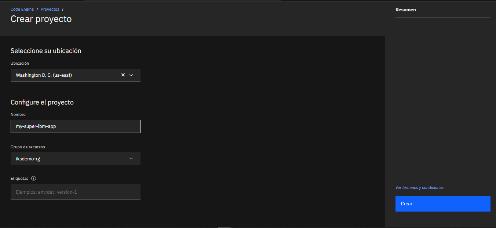

3. Ahora debera crear una API key para poder gestionar el repositorio de imagenes de ibm y desplegar su app correctamente, para esto deberá hacer click en el botón **Gestionar** está ubicado en la parte superior enseguida de la barra de busquedad y luego click en **Acceso IAM**.

Busque en el panel de la izquierda la opción **Claves de API** e ingrese.

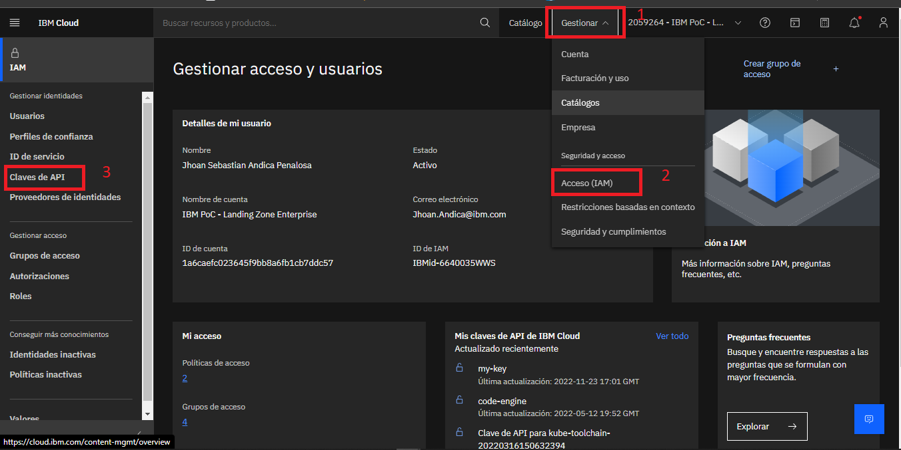

Luego de click en **Crear**

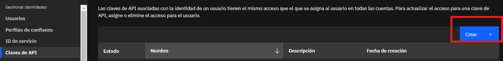

Nombre su apikey y de click en crear.

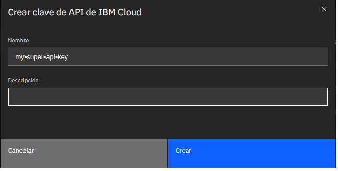

Por ultimo de click en copiar para guardar el valor. **Nota:** Es la unica oportunidad que tiene de ver el valor de la apikey sino lo guarda o copia deberá repetir este paso.

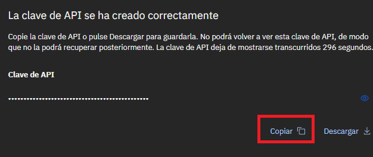

4. **Configurar el acceso a registro del proyecto:** Luego de generar y tener el valor de la API key tiene que almacenarla en su proyecto de code engine.

En el panel de la izquierda selecciona la sección acceso a registro y en el boton crear se despliega un menú que debe llenar asi:

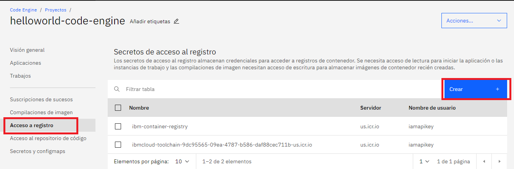

- _Orden de registro_: Seleccionar personalizado
- _Nombre de registro_: Puede usar el nombre sugerido
- _Nombre de usuario_: iamapikey
- _Servidor de registro_: En nuestro caso el servidor de us-south es us.icr.io. Usar el servidor de su region.
- _Contraseña_: Ingrese la apikey que genero o una existente.
- _Correo electronico_: El correo de su cuenta IBM cloud.

  Finalmente dar click en el botón crear.

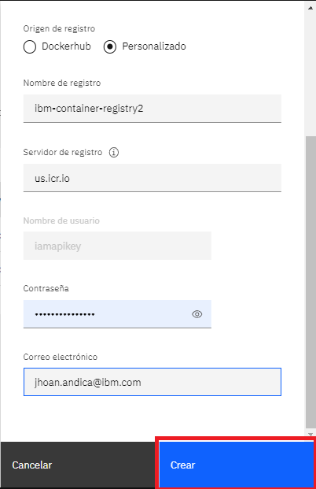  

5. En el proyecto que acaba de crear, nos dirigimos al apartado de aplicaciones y  presionamos el botón Create application.

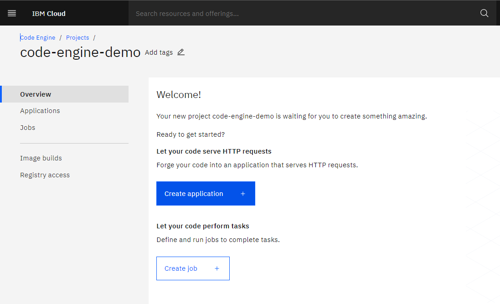

6. **Parámetros**

- **Name**: Escribimos el nombre de nuestra app. _Recomendación_: \<su-nombre\>-app. Por ejemplo, jesus-app.

- **Code**: Seleccionamos la opción **Source Code**. Nos aparecerá un cuadro de texto en el que debemos pegar el enlace al repositorio GitHub: https://github.com/Sebastian1811/IBM-Cloud-Code-Engine

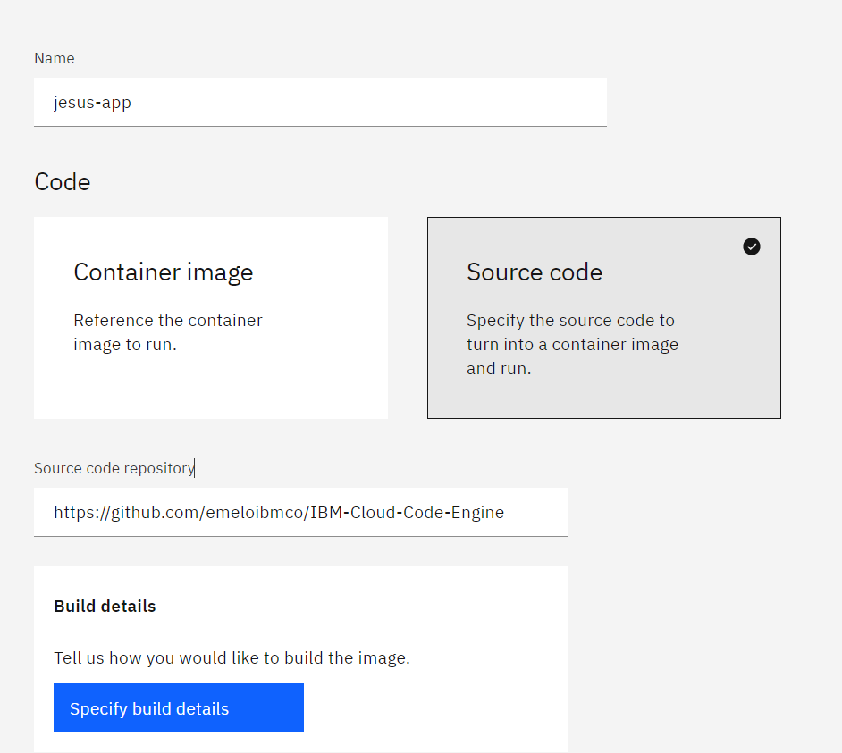

  
7. **Build Details**: presionamos el botón Specify build details, lo que nos desplegará un panel en el costado derecho de la pantalla. Llenamos los campos de acuerdo a la siguiente información:   
   **Pestaña Source**

- _Source repository_: Colocamos el enlace a nuestro repositorio GitHub
- _Branch name_: master
- _Context directory_: /helloworld   
  **Pestaña Strategy** 
  Dejamos los campos como están y presionamos next.   
  **Pestaña Output** 
  
- _Registry name_: code-engine-registry
- _Namespace_: Buscamos y seleccionamos de la lista, code-engine-ns.
- _Repository_: Buscamos y seleccionamos de la lista, hello-world-go.
- _Tag_: Dejamos el valor predeterminado, latest.

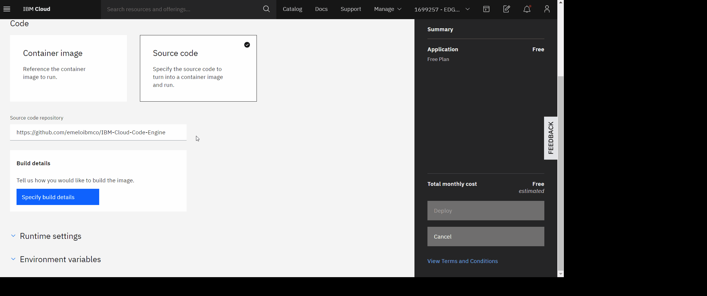

6. Finalmente, presionamos Deploy.

### Resultado

Tendremos el Dashboard de nuestra aplicación donde podremos cambiar la configuración de nuestra aplicación, generar una nueva versión, realizar una prueba a nuestro endpoint, entre otras funciones.

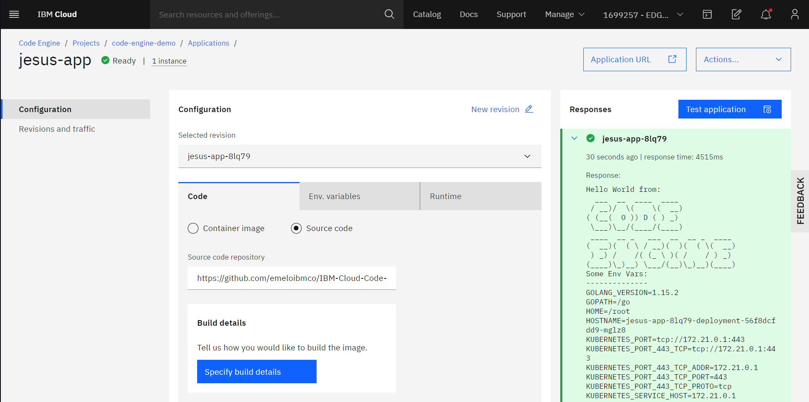

#### Endpoint

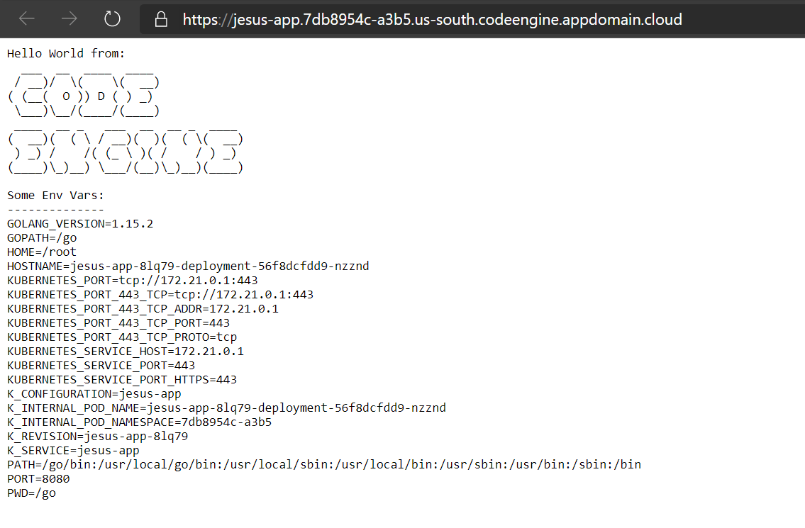

### Recursos Adicionales

- [IBM Cloud Code Engine](https://cloud.ibm.com/codeengine)
- Para preguntas o comentarios puede contactarnos por el Slack dedicado 
  [Register](https://cloud.ibm.com/kubernetes/slack) |
  [Login](https://ibm-cloud-success.slack.com/) y únete al canal
  [#code-engine](https://ibm-cloud-success.slack.com/archives/C014051FRCG)

### Autores

Equipo Cloud Tech Sales Colombia

IBM
